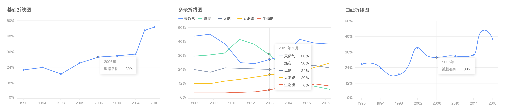
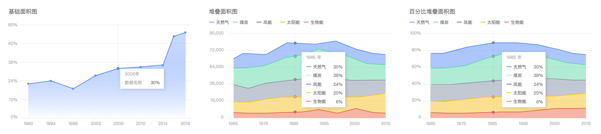
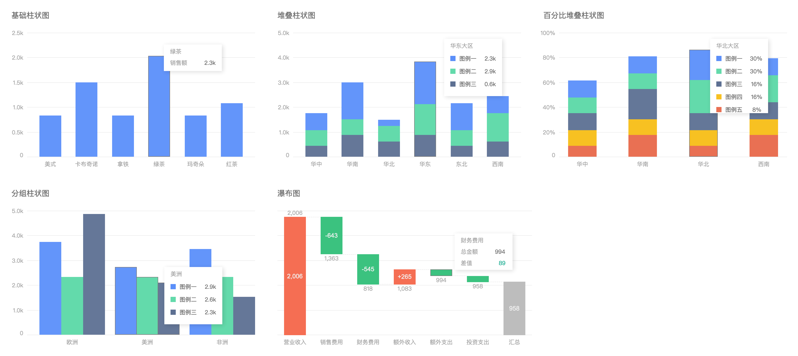
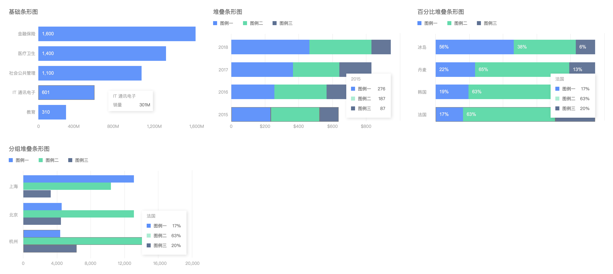
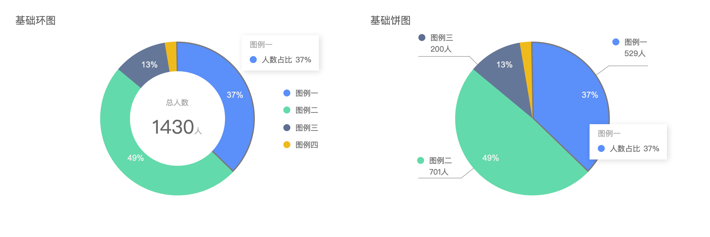
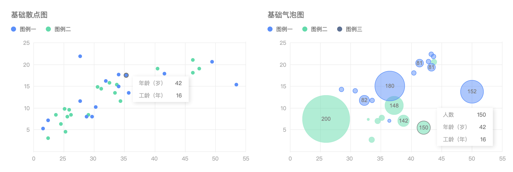
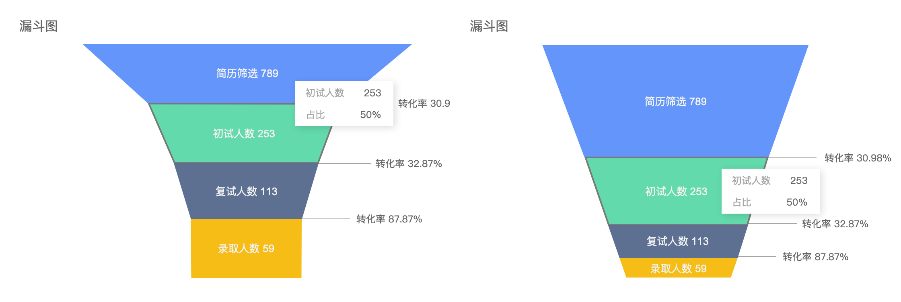
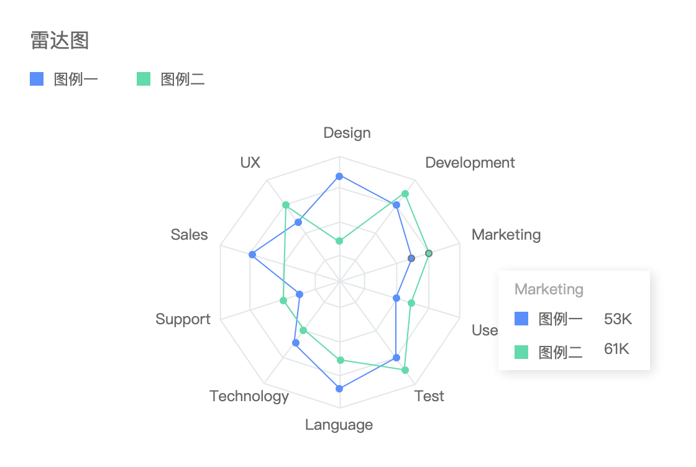
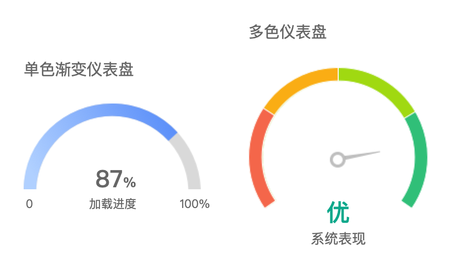
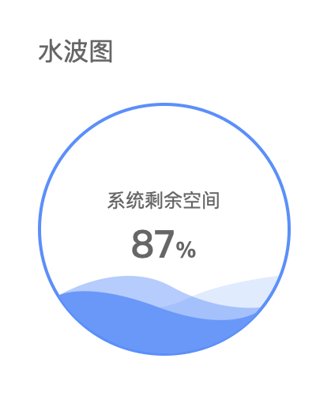

# 高保真图表组件库 AntDesignChart

## AntDesignChart 简介

Sketch 有大量精美的高保真图表库，但是 Axure 没有相应的组件库，所以为了以后的工作需要就花一些时间制作了这个组件库 AntDesignChart。

她有如下特点：

* 高保真组件：可以制作作为设计图使用
* 丰富的组件：包含基础组件、高级组件、迷你组件、地图组件等等
* 可灵活编辑：组件的各个部分都是可以根据你的需要灵活编辑的
* 细腻的动画：组件设置了非常细腻的交互动画（todo）

## AntDesignChart 预览

### 折线图

### 面积图

### 柱状图

### 条形图

### 饼环图

### 点图

### 漏斗图

### 迷你图

### 雷达图

### 仪表盘

### 水波图

### 高级图表

todo

### 3D地图

todo

### 地图

todo

## AntDesignChart 下载

[AntDesignChart]()

## 其它相关资源

|  名称   | 描述  |
|  ----  | ----  |
| [Ant Design Library](http://library.ant.design/)  | Ant Design Pro 组件库 Axure 版本 |
| [Ant Design Chart for Sketch](https://gw.alipayobjects.com/os/bmw-prod/704968a5-2641-484e-9f65-c2735b2c0287.sketch)  | Ant Design 风格的表格 Sketch 版本 |

## 关于我

区块链从业者，H5开发框架EgerPro作者，前Egret技术布道师。

关注我的视频号，了解研发、产品、设计、市场知识👋

